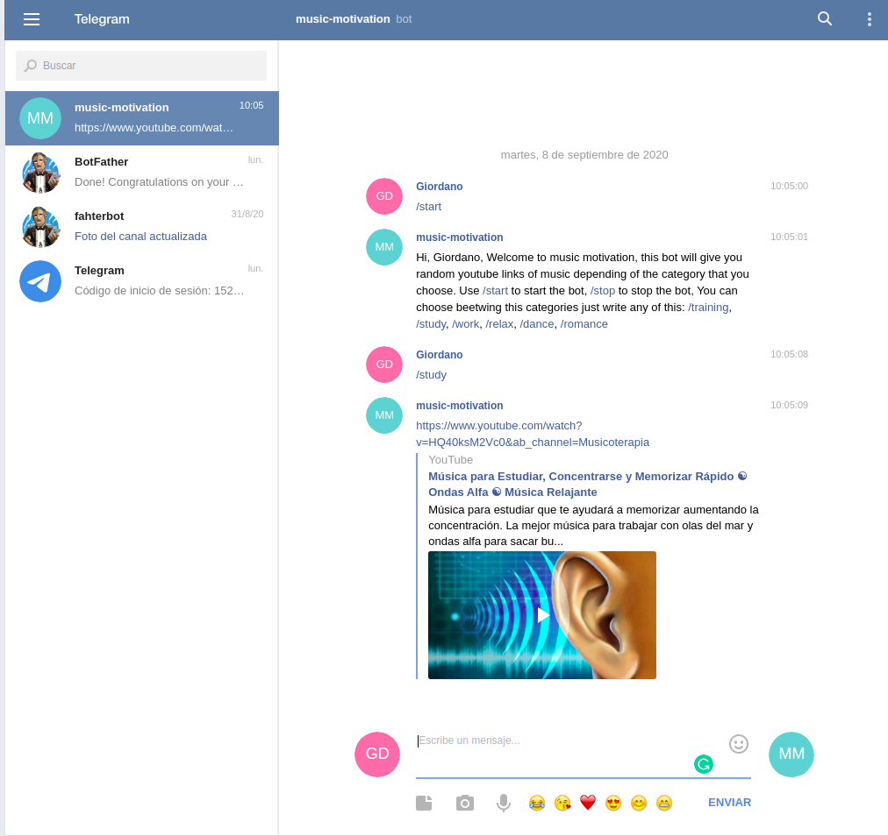

# 🧐 Music-Motivation Bot Telegram

> Ruby's Telegram-Bot Project



## Concept
> Telegram-bot, One of the most popular attributes from Telegram it's the possibility of creating your own bot that does whatever you want. In this opportunity, I create a bot to give you some random music for different occasions like training, study, relax, etc. The bot gives you a Youtube link to play this music.

## 🛠 Built With

- Ruby,
- Ruby gem Telegram-bot,
- Ruby gem Rspec
- Ruby gem Bundle
- Control version RVM
- Linters


## 🔧 Getting Started

> To get a local copy up and running follow these simple example steps.

- Go to the main page of the repo.
- Press the "Code" button and get the repo link.
- Clone it using git clone.

### 📝 Prerequisites

- Ruby -v2.7.0p0

### 📝 Setup

 - Open a terminal
 - Copy this code : 
        ```
        git clone "put the link from github repo"
        ```
- Run the program with this code :
        ```
        ruby bin/main.rb
        ```
- Stop the program with: "Ctrl + C" (Windows or Linux) or "Command + C"(Apple)

### 📝 How to interact with the bot?

- When the program is running go to your page of telegram

- Search for: @MusicMotiBot

- Click on Start

- Follow the instructions

- Enjoy the music.

### Usage

- Personal Project - Create a Telegram-bot to run basic concepts of Ruby language just for learning propose.

## 👤 Authors

👤 **Giordano Díaz**

- Github: [@diazgio](https://github.com/diazgio)
- Twitter: [@giordano_diaz](https://twitter.com/giordano_diaz)
- LinkenIn:[LinkenIn](www.linkedin.com/in/Giordano-Diaz)

## 🤝 Contributing

Contributions, issues and feature requests are welcome!

Feel free to check the [issues page](issues/).

## Show your support

Give a ⭐️ if you like this project!

## Acknowledgments

- Hat tip to anyone whose code was used
- Inspiration
- etc

## 📝 License

This project is [MIT](lic.url) licensed.
